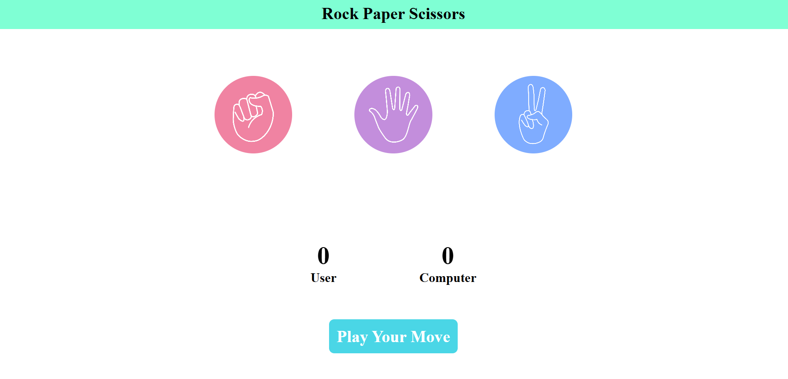

# ✊🖐✌️ Rock-Paper-Scissors Game

A fun and interactive **Rock-Paper-Scissors** game built using **HTML**, **CSS**, and **JavaScript**. The game lets you play against the computer with real-time score tracking and visual feedback for wins, losses, and draws.

## ✨ Features

- 🎮 Click-based gameplay (Rock, Paper, or Scissors)
- 🤖 Random computer choice generation
- 🧠 Win, lose, and draw detection logic
- 📊 Real-time score update
- 💡 Dynamic message updates with color indicators
- 📱 Responsive and intuitive UI

## 🚀 Technologies Used

- HTML5  
- CSS3  
- JavaScript

## 🖼️ Preview (<a href="https://shivam0713.github.io/Rock-Paper-Scissors-Game/">View Live</a>)



## 📂 Project Structure

```plaintext
rock-paper-scissors/
│
├── index.html         # Main game structure
├── style.css          # Styles and layout
├── script.js          # Game logic
├── screenshot.png     # Game screenshot
└── README.md          # This documentation
